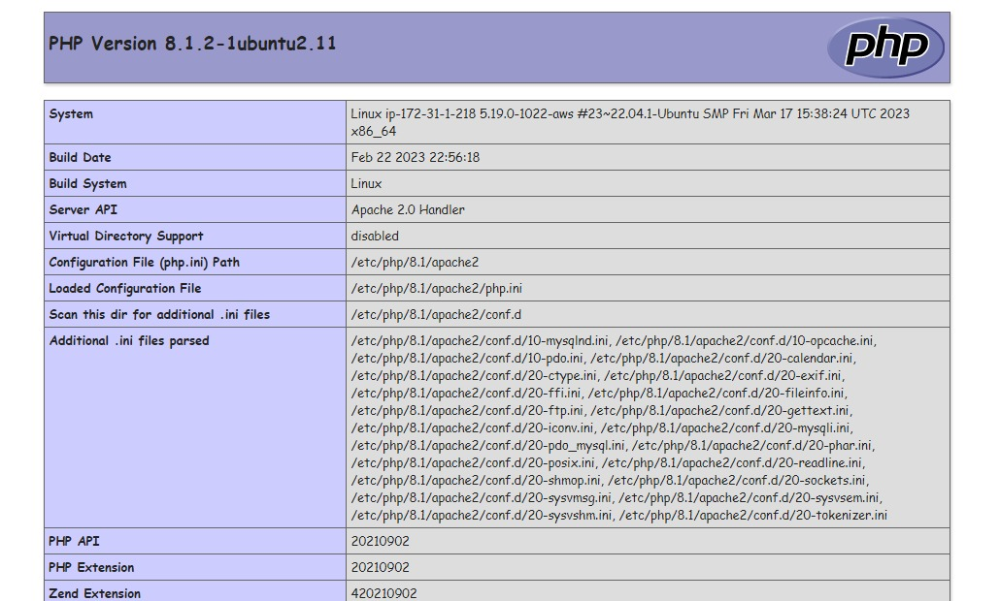

# LAMP 💡

LAMP stands for Linux, Apache, MySQL, and PHP. It is a group of open-source software typically installed together to enable a server to host dynamic websites and web apps.

This project automates the process of setting up a LAMP server using [Ansible](https://www.ansible.com/overview/how-ansible-works).

## How to use

This repository contains an Ansible playbook containing all the configurations for setting up a LAMP server on Ubuntu.

This playbook is broken down into 3 roles, Apache, MySQL and PHP, containing individual tasks in their `main.yml` files.

The folder structure looks like this:

```css
Apache/
└── tasks
    └── main.yml

mysql/
└── tasks
    └── main.yml

PHP/
├── tasks
│   └── main.yml
└── vars
    └── main.yml
```

After setting Ansible, run the following instructions. You can use this tutorial to [get started with Ansible](https://docs.ansible.com/ansible/latest/getting_started/index.html).

- Clone this repository
  
  ```powershell
  git clone https://github.com/Aahil13/LAMP.git
  ```

- Change directory to project
  
  ```powershell
  cd LAMP/
  ```

- Run the playbook
  
  ```powershell
  ansible-playbook -i inventory.ini lamp_playbook.yml --ask-become-pass
  ```

    .jpeg)

## The output

.jpeg)

**Note:**

1. If you're using the `/etc/ansible/hosts` file from the tutorial, you can discard the `inventory.ini` file.
2. Make sure to create an Ansible user.
3. To see the default PHP page, you can uncomment the code in the `main.yml` file of the PHP role.


